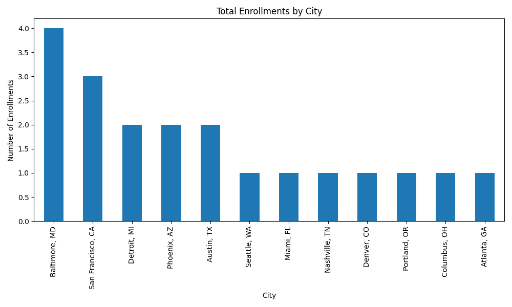
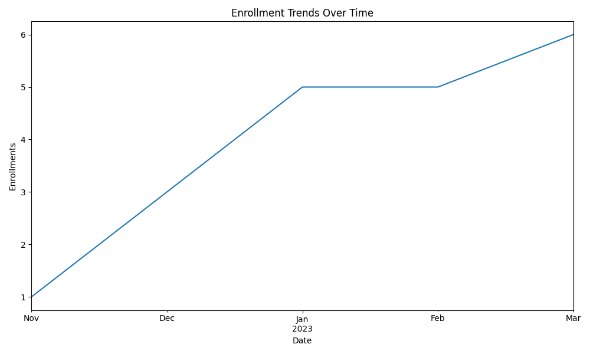

# Enrollment Impact & Engagement Analysis 


## Overview 

This project delivers an end-to-end solution for cleaning, analyzing, and visualizing enrollment data.
The goal is to help stakeholders understand program impact and engagement trends at a city level, while making the results accessible to non-technical users.

### The solution combines 

Python→ data transformation, analysis, visualization

Airtable→ collaborative system of record for review

### Problem Statement: 

  The raw enrollment dataset presented several challenges:

- Compound, delimiter-separated values within single columns

- Embedded metadata mixed with analytical fields

- No explicit definition of “impact” or “engagement”

### Stakeholders needed: 

- Clean, trustworthy data

- Clear city-level metrics

- A reviewable output without requiring code execution

### Definitions: 

### Impact

Impact is defined as:

- Total enrollments per city

- This metric provides a clear view of where programs reached the most participants.

### Engagement

Engagement is evaluated using:

- Enrollment activity over time

- First and last enrollment dates per city

- These indicators help distinguish sustained engagement from one-off participation.

### Solution Overview

The solution follows a reproducible data pipeline:

- Data Cleaning & Normalization

- City level Analysis

- Visualization for Leadership

- Airtable Integration for Review

Each stage produces a clear artifact that feeds the next.

### Project Structure
```text

enrollment-analysis/
├── data/
│   ├── raw_enrollment.csv
│   └── clean_enrollment.csv
├── scripts/
│   ├── clean_data.py
│   ├── analyze_engagement.py
│   ├── visualize_metrics.py
│   └── airtable_upload.py
├── visuals/
│   ├── enrollments_by_city.png
│   └── enrollment_trends.png
├── README.md
├── requirements.txt
└── .gitignore
```

## Implementation Details 

- Data Cleaning (clean_data.py)

- Parses compound, delimiter-separated fields

- Extracts atomic values (e.g., city name, enrollment date)

- Preserves original row counts for data integrity

- Outputs a reusable cleaned dataset: clean_enrollment.csv

### Analysis (analyze_engagement.py) 

- Aggregates enrollments by city

- Calculates: Total enrollments, First enrollment date, Last enrollment date

- Produces city-level impact and engagement metrics

### Visualization (visualize_metrics.py) 

- Generates leadership-friendly charts:

- Total Enrollments by City (impact)

- Enrollment Trends Over Time (engagement)

- Visuals are saved in the visuals/ directory and versioned with the code.

### Airtable Integration (airtable_upload.py)  

- Uploads cleaned enrollment records to Airtable

- Uploads aggregated city-level metrics to a separate table

- Enables filtering, sorting, and collaboration without requiring code access


### Assumptions & Design Decisions 

- Several fields contained compound, delimiter-separated values combining multiple attributes (e.g., city metadata and course details). These were normalized for analysis.

- Airtable’s internal record IDs were used instead of persisting a custom enrollment ID to avoid schema conflicts.

- Partial uploads were used during development for debugging; tables were cleared before the final load.

- Engagement was analyzed at a monthly level to balance clarity and signal strength.

### Setup Instructions 

- Create a virtual environment
python -m venv venv
source venv/bin/activate

- Install dependencies
pip install -r requirements.txt

- Configure environment variables

- Create a .env file in the project root:

    AIRTABLE_TOKEN=your_airtable_token
    AIRTABLE_BASE_ID=your_base_id

- .env is excluded from version control.
- Running the Project
- Clean the data
- python scripts/clean_data.py
- Analyze engagement
- python scripts/analyze_engagement.py
- Generate visualizations
- python scripts/visualize_metrics.py
- Upload results to Airtable
- python scripts/airtable_upload.py


## Visual Insights 


### Total Enrollments by City

- This chart highlights program impact by city, showing where enrollments were highest.
Cities such as Baltimore, MD and San Francisco, CA demonstrate higher participation, indicating stronger reach and adoption in those regions.

- This visualization helps stakeholders quickly identify:

    - High-impact cities

    - Regions with concentrated engagement

    - Potential areas for expansion or deeper investment



### Enrollment Trends Over Time

This time-series view illustrates enrollment activity over time, making it easy to distinguish between:

Sustained engagement (continued participation across months)

One-off participation (isolated enrollment events)

The trend provides insight into how engagement evolves rather than focusing on a single snapshot, supporting longer-term planning decisions.

## Future Improvements 

- Implement upsert logic for Airtable records
- Add unique participant tracking across cities
- Expand engagement metrics (repeat participation, cohort analysis)
- Introduce automated tests for data transformations

Author

Shumana Chowdhury
Senior Full Stack Developer Candidate